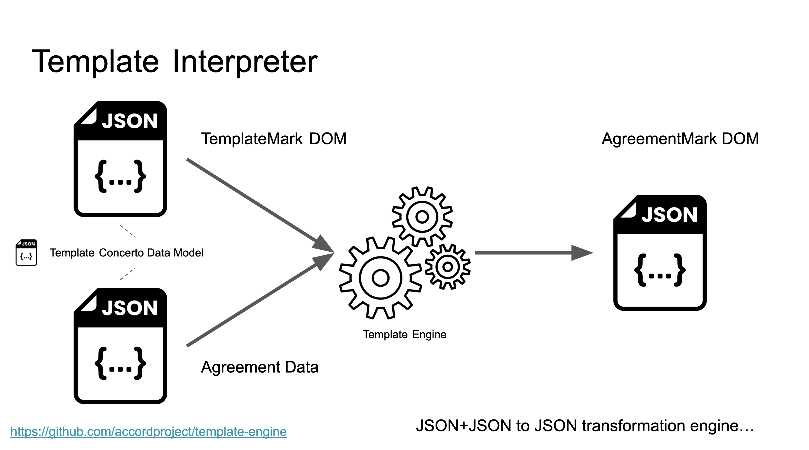

# Template Engine

This is the [Accord Project](https://accordproject.org) template engine. Rich-text templates are defined in TemplateMark (either as markdown files, or JSON documents) and are then merged with JSON data to produce output documents. Templates may contain [TypeScript](https://www.typescriptlang.org) expressions.

## Resources

- [Getting Started Video](https://vimeo.com/manage/videos/845273411)
- [Template Playground](https://playground.accordproject.org)
- [Running Code](https://replit.com/@dselman/AccordProjectTemplateEngine-Hello-World)

The core template engine is a JSON to JSON transformation that converts TemplateMark JSON + agreement data (JSON) to AgreementMark JSON.

> Note: Use the `@accordproject/markdown-transform` project to convert markdown templates to TemplateMark JSON and to convert AgreementMark JSON to output formats (HTML, PDF, DOCX etc.). For command-line usage please use `@accordproject/template-cli`.

TemplateMark is a document object model that describes a rich-text template, with embedded variables, conditional sections, formulae etc. TemplateMark uses embedded TypeScript expressions for conditionals and calculations.

> The format of both TemplateMark and AgreementMark is specified using the [Concerto](https://concerto.accordproject.org) data modeling language.

At a high-level the template engine converts a TemplateMark DOM to an AgreementMark DOM, evaluating TypeScript expressions for conditional sections and formulae, and replaces variable references with variable values from the supplied agreement data.



## Hello World Template

Let's create the simplest template imaginable, the infamous "hello world"!

> The code for this test is available at: https://github.com/accordproject/template-engine/blob/main/test/HelloWorld.test.ts

### Template Data Model

First create a template data model in Concerto syntax. The data model defines the structure of the data to be merged with the template. In this case the template model contains a single property `message` of type `String`. The property is required (it is not `optional`).

```javascript
namespace helloworld@1.0.0

@template
concept TemplateData {
    o String message
}
```

### TemplateMark (extended markdown)

Next define the TemplateMark for the template. In this case it is the plain-text world `"Hello"` followed by a space, then the variable `message` followed by `"."`.

```markdown
Hello {{message}}.
```

> Note that in this case the template is defined using an extended markdown syntax (rich-text with embedded variables etc.). The `@accordproject/markdown-transform` packages are used to convert the markdown to TemplateMark JSON, for use by the template engine.

### Generate AgreementMark from Data (JSON)

Define an **instance** of the `helloworld@1.0.0.TemplateData` data model. In this case setting the value of the `message` property to the string "World".

```typescript
const data = {
    $class: 'helloworld@1.0.0.TemplateData',
    message: 'World',
};
```
### Output AgreementMark (JSON)

When the TemplateMark and the data JSON is passed to the Template Engine it merges the two, in this case by simply replacing the reference to the `message` variable with its value from the data JSON and to produce an AgreementMark JSON document.

This AgreementMark JSON document can then be passed to the `@accordproject/markdown-transform` modules for conversion to markdown, PDF, HTML.

```json
{
    "$class": "org.accordproject.commonmark@0.5.0.Document",
    "xmlns": "http://commonmark.org/xml/1.0",
    "nodes": [
        {
        "$class": "org.accordproject.commonmark@0.5.0.Paragraph",
        "nodes": [
            {
            "$class": "org.accordproject.commonmark@0.5.0.Paragraph",
            "nodes": [
                {
                "$class": "org.accordproject.commonmark@0.5.0.Text",
                "text": "Hello "
                },
                {
                "$class": "org.accordproject.ciceromark@0.6.0.Variable",
                "value": "World",
                "name": "message",
                "elementType": "String"
                },
                {
                "$class": "org.accordproject.commonmark@0.5.0.Text",
                "text": "."
                }
            ]
            }
        ]
        }
    ]
}
```

## Next Steps

The Hello World example just scratches the surface of what can be accomplished! TemplateMark can define optional sections, conditional sections, TypeScript formulae/calculations and even reference external data.

Refer to the [full](https://github.com/accordproject/template-engine/tree/main/test/templates/full) example for details. 

> More detailed syntax documentation is to come!
Read the existing documentation at: https://docs.accordproject.org/docs/markup-templatemark.html

## Why create a new template engine?

There are many great Open Source template engines available, such as [Mustache](https://mustache.github.io), [Handlebars](https://handlebarsjs.com) or [EJS](https://ejs.co), so why create yet another?

### 1. Input and Output Format Agnostic

Most template engines are fundamentally **text based** — i.e. they treat templates as text strings and are glorified "find and replace" machines. This approach creates a coupling between the input format of the template, say, a DOCX file, and the output of the template engine, which in the case of a DOCX template, has to be a DOCX file. This makes supporting multiple input and output formats difficult.

The Accord Project template engine breaks the coupling between the template input format and the engine output format, and moves data format conversion outside of the core template engine. Templates at the engine level are TemplateMark JSON documents and the output from the template engine is an AgreementMark JSON document. Separate libraries are used to convert source templates into TemplateMark JSON, or to render AgreementMark JSON to an output format.

This flexibility allows a markdown template to be created that is used to create HTML, PDF or DOCX. One can even imagine using DOCX templates to create HTML or PDF files, or other scenarios.

### 2. TemplateMark as a Defined Format

TemplateMark JSON is a well-defined file format, meaning that powerful template editors can be created to define it: including widgets and user-experience for defining conditional sections, and formulae, and offering template preview and integrated testing. Template editing is closer to programming in our opinion than word-processing.

We encourage community and commercial innovation in this area!

### 3. Logic FULL

Unlike some templating systems which prohibit, or minimize, logic in templates, Accord Project templates fully embrace templates that may contain sophisticated logic: conditional logic to determine what text to include, or even calculations, for example to calculate the monthly payments for a mortgage based on the term of the mortgage, the amount and the interest rate.

### 4. Type-safety

Given the ability for templates to contain logic there's an imperative to ensure that the templates are **safe** - i.e. when a template is merged with well-structured data it is guaranteed to produce well-structured output.

Too many templating engines fail in unpredictable ways at runtime, or silently generate invalid output, when presented with data — unacceptable for enterprise usage.

Accord Project templates are therefore **strongly-typed**. The logic in templates is expressed in [TypeScript](https://www.typescriptlang.org). TypeScript is a strongly-typed, general purpose programming language, supported by a vibrant Open Source and enterprise community. TypeScript compiles to JavaScript for easy execution on most platforms.

### 5. Data Model

The rich-text with variables of a template is associated with a [Concerto data model](https://concerto.accordproject.org). The Concerto data model defines the structure of the data required for the template, and is used to statically compile the template and verify type-safety, and is also used at runtime to ensure that incoming data is well structured.

### 6. Compilation

Templates may be statically compiled to TypeScript programs, enforcing type-safety, ensuring that no unsafe code evaluation ("eval") is required at runtime, and easing integration into applications.

The template compiler is a separate project, hosted here: https://github.com/accordproject/template-compiler

## Install

Note that this module is primarily intended for tool authors, or developers embedding template engines within applications. For command-line usage please refer to the `@accordproject/template-cli` package which implements a full pipeline to convert markdown templates plus JSON data to supported output formats, such as HTML, DOCX or PDF.

```
npm install @accordproject/template-engine --save
```

## License <a name="license"></a>
Accord Project source code files are made available under the Apache License, Version 2.0 (Apache-2.0), located in the LICENSE file. Accord Project documentation files are made available under the Creative Commons Attribution 4.0 International License (CC-BY-4.0), available at http://creativecommons.org/licenses/by/4.0/.

